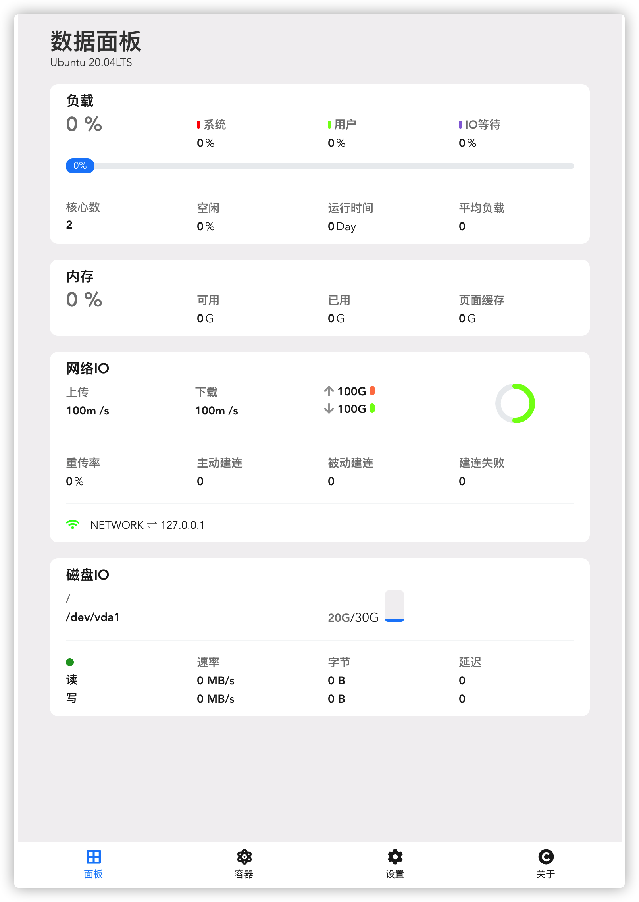
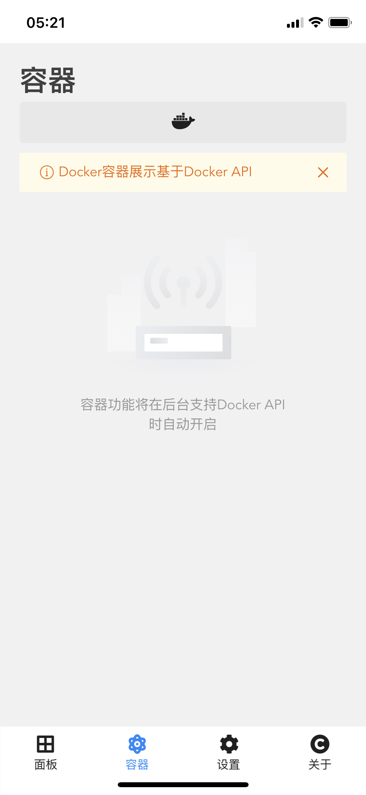
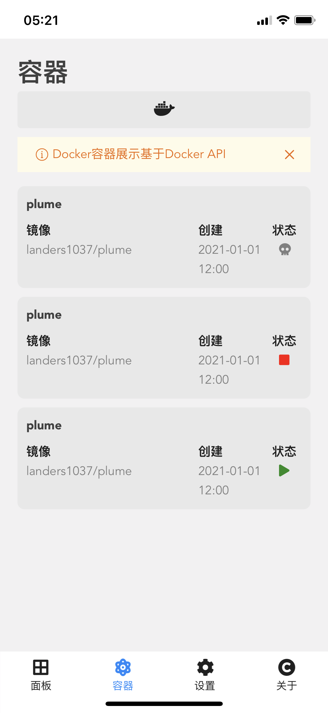
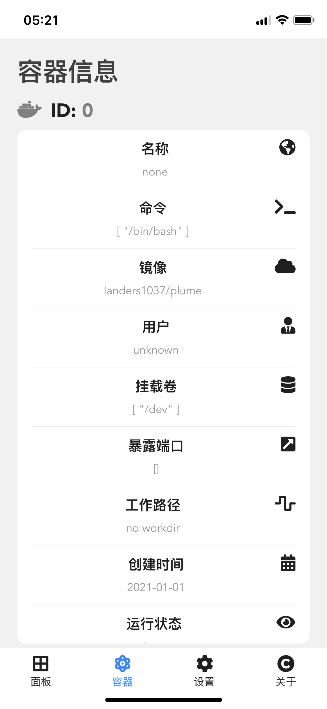
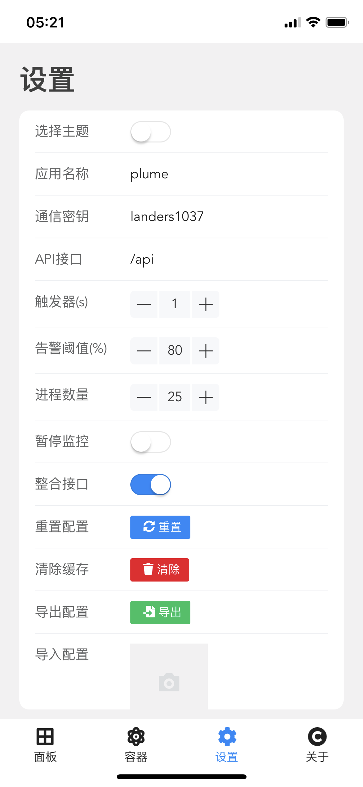
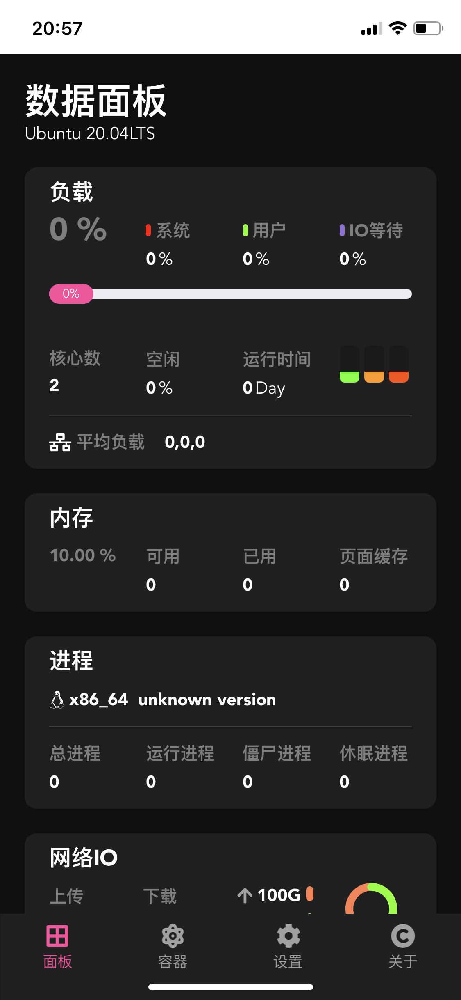

# plume-app

一个服务器可视化webapp

模仿ios应用 [serverCat](https://servercat.app/)编写

## Project setup
```
npm install
```

### Compiles and hot-reloads for development
```
npm run serve
```

### Compiles and minifies for production
```
npm run build
```

## 依赖

本服务尽量使用linux自带的命令获取系统信息

对于一些特殊需求，需要安装额外的程序

对于ubuntu

```bash
apt install sysstat
```


## 示例






**同时支持暗黑模式切换**








